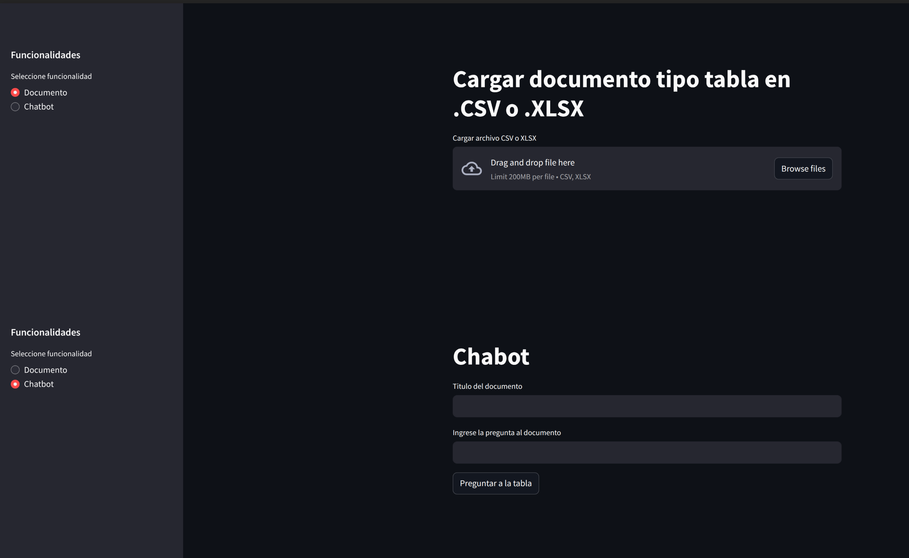

## rag-tables-arquitecture

### Diagrama de flujo

El microservicio de `rag-tables` se describe en la siguiente figura:

<div align='center'>

</div>

Se tiene un servicio de backend espuesto a través de `FastAPI` que contiene el pipeline de un **RAG** orquestado por `Langchain` que permite ingestar información de tablas en una base de datos vectorial, `chromadb` y contecta con un LLM para responder preguntas con contexto basado en la base de conocimiento. 

### Stack y componentes

#### Orquestador
El desarrollo del RAG se realizó con `Langchain`, el cual es un framework que permite la integración sistemática de aplicaciones con LLM's. Su elección radica en su naturaleza de código abierto, amplia comunidad, integración con un gran número de herramientas y estar basado en `Python`. Una de las grandes ventajas es la incorporación del `LCEL` (LangChain Expression Language) que permite la creación de cadenas de procesos expresadas de forma simplificada e.g: *prompt | LLM | parser*.

#### Modelo de lenguaje y embeddings
Es el componente primordial del pipeline, ya que es el que procesa la pregunta y con el contexto proporcionado organiza la respuesta, dada la compatiblidad de LangChain se pueden utilizar multitud de proveedores de modelos de lenguaje, tales como: OpenAI, Google, Antropic, Grok. Por experiencia en anteriores desarrollos y por una buena relación costo beneficio, se seleccionaron los modelos de lenguaje proporcionados por openAI, en particular se emplea `gpt-4o-mini` ya que presenta resultados buenos-altos en los benchmarks, tiene una integración excelente con LangChain y el costo por token es aceptable. Dada la elección del modelo de lenguaje, se condiciona parcialmente el modelo de embeddíngs, el cual es un *transformer* especial que permite convertir fragmentos de texto a una representación vectorial para posteriores busquedas por similitud semántica, para este propósito se empleó
de embeddings `text-embedding-ada-002`, el cual tiene una buena relación costo por token y su integración con los modelos de OpenAI es recomendable.

Una alternativa igualmente buena sería usar el LLM `gemini-flash-2.0` con los embeddings `gemini-embedding-001`.

Y si se quisiera un modelo propierario (local) se podría usar `llama-3.1-8b` con los embeddings de Huggingface `all-MiniLM-L6-v2`.

Para la clasificación de los chunk se utilzó un modelo adicional, `cohere-rearank-v3`, este modelo permite elegir aquellos fragmentos de contexto que mayor relación tengan con la pregutna realizada, de esta manera se tiene mayor coherencia entre la información recuperada y la pregunta realizada, evitando procesar tokens de fragmentos poco relevantes. 

Cabe destacar que en general el modelo de embeddings no es restrictivo a un modelo de lenguaje, pero los proveedores insisten que sus modelos propietarios están ´mejor´ entrenados y ´mejor´  integrados.

#### Base vectorial
El pipeline de RAG se apalanca en la base de datos vectorial, la cual es una base de datos especializada en almacenar los vectores de los embeddings de texto. Para esta aplicación se eligió `chromadb` por su compatibilidad con `LangChain`, por ser de código abierto, por la posibilidad de ejecutarla de forma local o contenerizada y también por la API que expone para poder interactuar con ella, esto es, la operaciones se pueden realizar vía API-REST o en su defecto utilizando funciones de LangChain. Se destaca el hecho que las operaciones pueden ser normales o asincronas, esto es relevante, ya que si se tiene un volumen alto de operaciones el asincronismo garantiza que se puedan realizar corutinas sin bloquear el proceso principal. 

<div align='center'>

</div>

#### Framework de backend
Para el servicio de carga y consulta del RAG se empleó `FastAPI`, principalmente por su buen desempeño en aplicaciones de backend, manejo de asincronismo y facilidad de integración con `LangChain`. Se siguió el esquema de **MVC**, separando los componentes del servicio por *controladores* - *modelos* y *servicios*. El microservicio diseñado cuenta con tres enpoints principales:

+ *health*: **get** - Revisa si el microservicio está en linea.
+ *upload*: **post** - Recibe un payload con el documento tipo tabla codificado en `base64` para ser ingestado en la base de datos vectorial. Si bien `FastAPI` permite adjuntar directamente un archivo al request, se optó por esta alternativa para tener mayor universalidad, aunque no es recomendable para archivos de masiado grandes, ya que se superaría el tamaño máximo del payload.
```js
// Entrada
{
  "title": "title-example",
  "document_type": "documento-tabla",
  "document_bytes": "base64-encoded-document"
}
// Salida
{
  "query_id": "query-id",
  "status": true/false
}
```
+ *ask*: **post** - Recibe un payload con una pregunta para ser respondida con el contexto de la base de conocimiento de los documentos ingestados. Es el endpoint principal del chat, retorna una salida parseada directmente como string
```js
// Entrada
{
  "title": null,
  "document_type": "documento-tabla",
  "query": "¿what is the tax rate for the first 6000 eur in spain?",
  "k_results": 4,
  "metadata_filter": {}
}
// Salida
{
  "query": "¿what is the tax rate for the first 6000 eur in spain?",
  "result": "The tax rate for the first EUR 6,000 in Spain is 19%."
}
```

#### Frontend
Se tiene un front diseñado en `steamlit` con dos páginas principales, una para carga de documentos y la otra para realizar las preguntas a la base vectorial.

<div align='center'>

</div>

La elección radica en gran medida en que es un framework con componentes prediseñdos, ideal para presentar información, obtener formulario o integrar API's como en el presente caso. No obstante para una aplicación de mayor envergadura sería recomendable suar un framework más robusto basado en JS como React o Vue.


#### Cloud

Para el despliegue del servicio a nivel de cloud, se eligió AWS, por una cuestión de experiencia, sin embargo se puede usar GCP, ya que los servicios propuestos cuentan con su equivalente en ambas nubes.

Se plantearon dos aquitecturas, una simplificada y otra de nivel productivo.

##### Arquitectura simplificada

Para desplegar el microservicio en AWS se propone un arquitectura de API Gateway conectado a una EC2 con docker. La EC2 contendría cada uno de los contenedores necesarios MS con `FastAPI`, `chromadb`, `postgresql` y `streamlit`. Con una IP stática se pueden lanzar los servicios en diferentes puertos, y la comunicación entre contenedores se haría a nivel de instancia, la comunicación del servicio se rutearía a un API-Gateway HTTP, ofreciendo la capa de seguridad necesaria para consumir el microservicio.

<div align='center'>

</div>

La arquitectura simplificada, podría soportar una concurrencia de 10 a 15 requests por segundo, no estaría pensada para escalar, pero si como prueba de concepto.

| Servicio | Configuración | Costo mensual |
|---------|---------------|-------------|
| API Gateway | 15,000 requests | $0.05 |
| EC2 t3.small | 2 vCPU, 2GB RAM, 24/7 | $15.18 |
| EBS Storage | 20GB GP3 SSD | $1.60 |
| Elastic IP | Static IP address | $3.65 |
| **TOTAL** | | **$22.48/mes** |

El equivalente en GCP sería Apigee conectado a una instancia en Google Compute Engine.

##### Arquitectura escalable

Para desplegar el microservicio de forma escalable y de alta disponibilidad se propone una arquitectura con el mismo API-Gateway HTTP al inicio, el cual se encargaría de una capa inicial de seguridad y de gestionar los requests al sistema, luego se conectaría a un blanceador de carga conectado a un cluster de ECS con el contenedor del microservicio de `FastAPI`, dependiendo de la demanda este cluster puede crecer de forma horizontal de acuerdo con politicas predefinidas, los contenedores del microservicio se conectarían a otro ECS con el contenedor de la base vectorial en `chromadb`, dada la naturaleza asincronica de ese servicio podría manejar múltiples solicitudes sin necesidad de escalar horizontalmente. No obstante, para soluciones tipo enterprise, se recomendaría el uso de servicios como `Pinecone`, una base vectorial cloud base serverless de alta capacidad y disponibilidad. Finalmente se sugiere una base de datos (de preferencia relacional) para almacenar las respuestas del microservicio, esto con dos propósitos: primero, persistencia de información, y segundo como una potencial base de cache, esto es, si se realiza la misma pregunta, se pueda usar una respuesta previamente resuelta como solución.

<div align='center'>

</div>

Con un pico de 20 requests/sec y una media de 1000 requests por día, la distribución aproximada de costos sería:

| Servicio | Costo mensual |
|---------|-------------|
| API Gateway | $0.11 |
| ALB | $27.72 |
| ECS Fargate | $64.69 |
| RDS PostgreSQL | $29.02 |
| **TOTAL** | **$139.64/mes** |

### Funcionamiento

En la sección de [diagrama](#diagrama-de-flujo) se proporciona una  vista general del funcionamiento del sistema, en esta sección se describirá en más detalle el flujo del pipeline del RAG: transformación del documento -> splitting -> chunking -> embeddings -> ingesta en base vectorial -> semantic search -> retrieval.

+ *transformación del documento:* En esta etapa se decodifica el archivo en base64 y se recrea el documento binario en forma de tabla `csv`. Luego se crea un listado de `Document` de `Langchain`, objetos que contienen atributos para la ingesta en bases vectoriales como: `page_content` y un diccionario con metadata.

+ *splitting:* La idea del RAG es solo proporcional el contexto relacionado al LLM para que pueda responder, mediante el splitting se define una estrategia de fragmentación del texto conservando sentido semántico, normalmente eso se logra dividiendo por parrafos. La estrategia más comun es el *recursive splitting* que busca caracteres de terminación de oraciones con un limite de caracteres. 

+ *chunking:* Con la estrategia de splitting definida, se fragmenta el texto en trozos con sentido semántico, esto es la lista de `Documents` se divide aún más. Cada `chunk` contiene texto y metadata para filtrar la busqueda, asimismo no es recomendable que supere los 2000 caracteres facilitar el paso de embeddings.

+ *embeddings:* En esta etapa se transforma cada trozo de texto a su representación vectorial mediante un modelo de transformers que permite la comparación semántica. Los embeddings son un vector de una dimensión definida (por cada modelo) que representa el texto, y a la final es lo que se almacena en la base vectorial.

+ *ingesta en vdb:* Con la conversión de los trozos de texto a embeddings se almacenan en la base de datos vectorial, en el caso de chroma se tiene una estructura: tenant -> database -> collection, y las colecciones almacenan documentos, por ende con el método `add_documents` se ingesta en la base vectorial.

+ *semanctic search:* Es el proceso de consulta a la base vectorial, una pregunta o query se transforma a su representación vectorial a través del modelo de embeddings y por el criterio de *cosine-similarity* se eligen los vectores de mayor similitud a la pregunta, esto es, el modelo de embeddings garantiza que la representación en vector conserve el sentido semántico del texto. La busqueda vectorial puede retornar los `n` vectores más similares a la pregunta.

+ *retrieval:* Es el último componente del RAG, en esta etapa con una cadena de `LangChain` se invoca al LLM para responder la pregunta y se agrrega como contexto los trozos de texto de mayor similitud recuperados de la base vectorial, de esta manera el modelo de lenguaje tiene información de una fuente validada para responder.


### Comentarios y recomendaciones

+ **Escalabilidad:** Con la arquitectura escalable se pueden tener muchas consultas por mes, adicionalmente se recomendaría usar una base vectorial enterprise grade como pinecone. Del mismo modo si los documentos son de gran extensión se optaría por un modelo de subida a un sistema de almacenamiento como S3 o la ingesta directamente de tablas de bases de datos tabulares.

+ **Memoria:** Se puede agregar un mecanismo de memoria al endpoint de `ask` de esta manera las preguntas se pueden enlazar con respuestas anteriores, creando una conversación.

+ **Mecanismo de cache:** Se puede implementar una capa de cache usando `redis`, para que la respuesta de preguntas previamente realizadas se mantenga en una memoria de corto plazo, permitiendo el ahorro de tokens de modelos de lenguaje y embeddings.