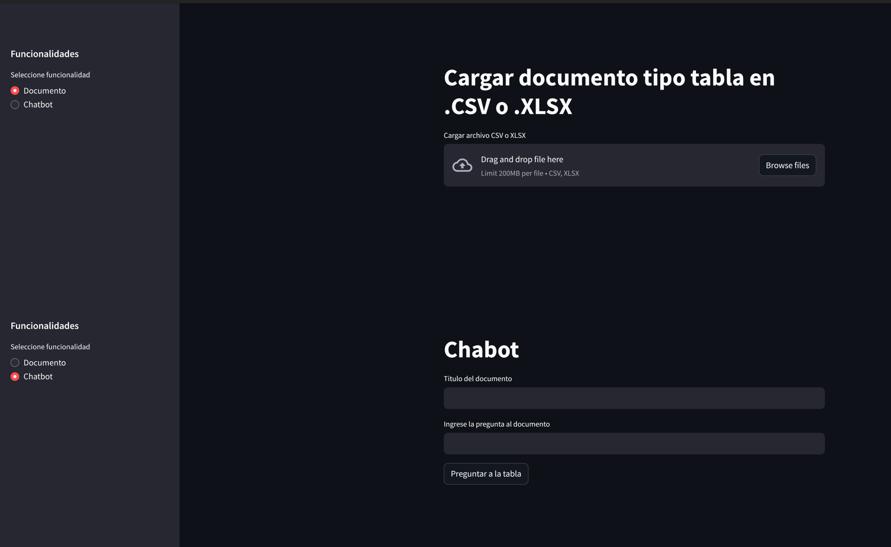

## rag-tables

### Generalidades
`rag-tables` es un microservicio que implementa un pipeline de RAG para procesar documentos en formato de tablas: `csv` y `xlsx`.

### Requerimientos

#### Orquestador
El desarrollo del RAG se realizó con `langchain`, el cual es un framework que permite la integración sistemática de aplicaciones con LLM's. En el archivo [langchain-requirements](/langchain-requirements.txt) se encuentran los paquetes requeridos.

#### Modelo de lenguaje
El desarrollo actual se apoya en el uso de modelos de lenguaje proporcionados por openAI, en particular se emplea `gpt-4o-mini` y el modelo de embeddings `text-embedding-ada-002`.

#### Base vectorial
El pipeline de RAG se apalanca en la base de datos vectorial `chromadb` por su compatibilidad con `langchain`. Si bien `chroma` puede correr de forma local (paralelamente con el servicio), se decidió ejecutarla de forma independiente de forma contenerizada en docker, debido a que la interacción se puede hacer via consumo de API REST.

Se utilizó la imagen con tag: 1.0.12:
```
docker pull chromadb/chroma:1.0.12
```

Lanzar contenedor:
```
docker run -d -v <ruta_volumen_host>:/data -p 9000:8000 --name chromadb_1_0_12 chromadb/chroma
```

#### Framework de backend
Para el servicio de carga y consulta del RAG se empleó `fastapi`, principalmente por su buen desempeño en aplicaciones de backend, manejo de asincronismo y facilidad de integración con `langchain`. El microservicio diseñado cuenta con tres enpoints principales:

+ *health*: **get** - Revisa si el microservicio está en linea.
+ *upload*: **post** - Recibe un payload con el documento tipo tabla codificado en `base64` para ser ingestado en la base de datos vectorial.
```js
{
  "title": "title-example",
  "document_type": "documento-tabla",
  "document_bytes": "base64-encoded-document"
}
```
+ *ask*: **post** - Recibe un payload con una pregunta para ser respondida con el contexto de la base de conocimiento de los documentos ingestados. Es el endpoint principal del chat.
```js
{
  "title": null,
  "document_type": "documento-tabla",
  "query": "¿what is the tax rate for the first 6000 eur in spain?",
  "k_results": 4,
  "metadata_filter": {}
}
```

#### Frontend
Se tiene un front diseñado en `steamlit` con dos páginas principales, una para carga de documentos y la otra para realizar las preguntas a la base vectorial.

<div align='center'>

</div>


### Ejecución y uso

Se requiere `Python +3.10` para la ejecución de la aplicación.

Se recomienda la creación de un entorno virtual:
```bash
python -m venv v_rag_tables
source v_rag_tables/bin/activate
```

Instalación de requerimientos:
```bash
pip install -r requirements.txt
```

Se requiere un archivo `.env` con las claves:
```bash
OPENAI_API_KEY= #llave de openai
COHERE_API_KEY= # llave para modelo de rerankeo de cohere
CHROMADB_HOST= # datos base vectorial
CHROMADB_PORT=
ANONYMIZED_TELEMETRY=False
LANGSMITH_TRACING=true # variables de trazabilidad en langsmith
LANGSMITH_ENDPOINT=
LANGSMITH_API_KEY=
LANGSMITH_PROJECT=
API_HOST= # url del ms
API_PORT= # puerto del ms - si aplica
```

Ejecución del microservicio en `fastapi` (alternativamente se puede agregar nohup para mantener el proceso corriendo):
```bash
uvicorn main:app --host 0.0.0.0 --port <port-number>
# uvicorn main:app --host 0.0.0.0 --port 8106
```

Para la ejecución del front de `streamlit` (alternativamente se puede agregar nohup para mantener el proceso corriendo):
```bash
streamlit run front.py --server.port <port-number>
#streamlit run front.py --server.port 8107
```

Para efectos de prueba se ejecutó de forma local, en caso de tener una ip fija se sustituye el host por dicha dirección.


### Video 

Video con prueba de funcionamiento: [enlace](https://youtu.be/EqXfKMaeGfs)